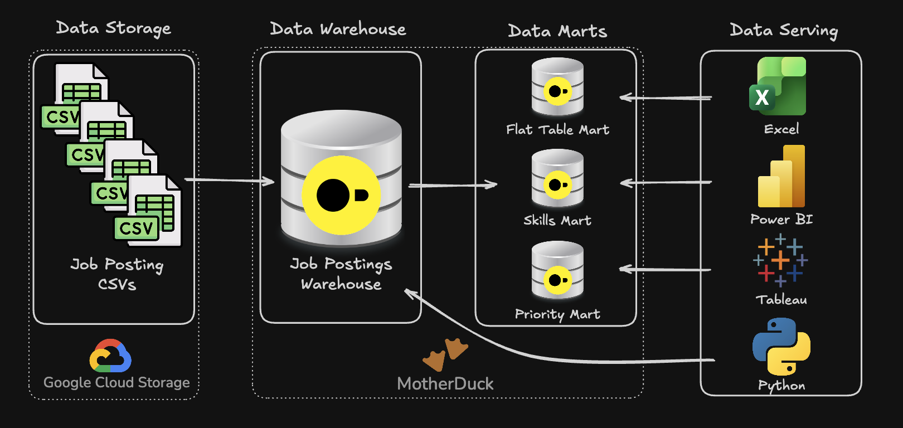
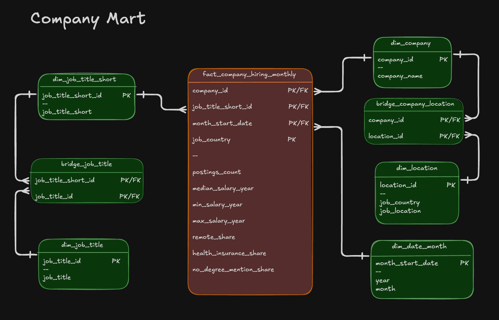

## 🏗️ Data Warehouse & Mart build: Production ETL Pipeline

An end-to-end data engineering pipeline that transforms raw CSV files stored in Google Cloud Storage into a structured star schema data warehouse, followed by the creation of analytical data marts.

---

## 🧾 Executive Summary (For Hiring Managers)

- ✅ **Pipeline scope:** Developed a full **ETL pipeline** from raw CSV ingestion to a star schema warehouse and downstream analytical marts

- ✅ **Data modeling:** Implemented a star schema design including fact tables, dimensions, and bridge tables for many-to-many relationships

- ✅ **ETL development:** Built robust **extract, transform, load workflows** with idempotency and data validation checks

- ✅ **Mart architecture:** Designed **purpose-built data marts** (flat, skills, priority) with additive metrics and incremental refresh capabilities

---

## 🧩Problem & Context

Raw job posting data is received as flat CSV files in Google Cloud Storage. This format is not optimized for analytical workloads. Analysts need to answer questions such as:

- Which skills are trending over time?
- What hiring patterns exist across companies and locations?
- How do salaries vary by job role and required skill sets?

**Challenge:** There is no centralized, structured system to ensure consistent and reliable analysis. Teams require a single source of truth (data warehouse) along with optimized data marts for specific use cases.

**Solution:** Built an end-to-end ETL pipeline that:

- Extracts CSV data from cloud storage
- Transforms and normalizes the data into a star schema warehouse
- Produces specialized data marts for different analytical needs (e.g., skill trends, priority roles, flat querying)

---

## 🧰 Tech Stack

- 🐤 **Database:** (lightweight OLAP database with GCS integration via `httpfs`)
- 🧮 **Language:** SQL (DDL for schema design, DML for data loading and transformation)  
- 📊 **Data Model:** Star schema (fact, dimension, and bridge tables) 
- 🛠️ **Development:** VS Code for SQL editing + Terminal for DuckDB CLI execution  
- 🔧 **Automation:** Master SQL script orchestrating full pipeline execution
- 📦 **Version Control:** Git/GitHub for tracking and versioning 
- ☁️ **Storage:** Google Cloud Storage for raw CSV inputs 

---

## 🏗️ Pipeline Architecture

This pipeline processes job posting CSV files from Google Cloud Storage, loads them into a star schema data warehouse, and generates specialized analytical marts. These outputs are consumed by BI tools such as Excel, Power BI, Tableau, and Python.

### Data Warehouse

The warehouse follows a star schema design using the following tables: `company_dim`, `skills_dim`, `job_postings_fact`, and `skills_job_dim` tables.

- **SQL Files:**
  - [`01_create_tables_dw.sql`](./01_create_tables_dw.sql) – Defines star schema with 4 core tables
  - [`02_load_schema_dw.sql`](./02_load_schema_dw.sql) –  Loads CSV data into the warehouse
- **Purpose:** Centralized, consistent source of truth for analytics
- **Grain:**  One row per job posting (`job_postings_fact`)

### Flat Mart

A fully denormalized dataset combining all dimensions for easier querying.

- **SQL File:** [`03_create_flat_mart.sql`](./03_create_flat_mart.sql) – Builds denormalized table with all dimensions joined
- **Purpose:** Denormalized table for quick ad-hoc queries
- **Grain:** One row per job posting with all related attributes

### Skills Mart

Designed for time-series analysis of skill demand trends.

- **SQL File:** [`04_create_skills_mart.sql`](./04_create_skills_mart.sql) – Builds time-series skill demand mart
- **Purpose:** Analyze skill demand over time with consistent aggregation
- **Grain:** `skill_id + month_start_date + job_title_short`
- **Key Features:** Fully additive metrics for flexible aggregation

### Priority Mart

Tracks key roles using incremental updates with MERGE logic.

- **SQL Files:**
  - [`05_create_priority_mart.sql`](./05_create_priority_mart.sql) – Initial snapshot build
  - [`06_update_priority_mart.sql`](./06_update_priority_mart.sql) – **Incremental update using MERGE** (upsert pattern)
- **Purpose:** Monitor priority job roles efficiently
- **Grain:** One row per job posting with assigned priority level
- **Key Features:** **MERGE operations for incremental updates** - demonstrates production-ready upsert patterns (INSERT, UPDATE, DELETE in single statement)

### Company Mart

Provides insights into hiring trends by company, role, and location.

- **SQL File:** [`07_create_company_mart.sql`](./07_create_company_mart.sql) – Builds company hiring trends mart (optional)
- **Purpose:** Analyze hiring patterns across companies and regions
- **Grain:** `company_id + job_title_short_id + location_id + month_start_date`
- **Key Features:** Uses bridge tables for many-to-many relationships
- **Note:** Optional component based on use case needs

---

## 💻 Data Engineering Skills Demonstrated

### ETL Pipeline Development

- **Extract:**  Loaded CSV files directly from Google Cloud Storage using DuckDB `httpfs` 
- **Transform:**  Cleaned and standardized data using SQL (`CAST`, `DATE_TRUNC`)
- **Load:** Built idempotent processes using `DROP TABLE IF EXISTS`  
- **Incremental Updates:** Implemented MERGE-based upserts for efficient updates
- **Orchestration:** Master SQL script (`build_dw_marts.sql`) for automated pipeline execution  

### Dimensional Modeling

- **Star Schema Design:** Fact table (`job_postings_fact`) with dimension tables (`company_dim`, `skills_dim`)  
- **Bridge Tables:** Many-to-many relationship handling (`skills_job_dim`, `bridge_company_location`, `bridge_job_title`)  
- **Grain Definition:** Proper fact table granularity (skill+month, company+title+location+month)  
- **Additive Measures:** Counts and sums that can be safely re-aggregated at any level  
- **Surrogate Keys:** Sequential ID generation using CTEs with self-joins (optional company_mart build only)  

### SQL Advanced Techniques

- **DDL Operations:** `CREATE TABLE`, `DROP TABLE`, `CREATE SCHEMA` for schema management  
- **DML Operations:** `INSERT INTO ... SELECT` with explicit column mapping from CSV sources  
- **MERGE Operations:** Incremental updates using `MERGE INTO` with `WHEN MATCHED`, `WHEN NOT MATCHED`, and `WHEN NOT MATCHED BY SOURCE` clauses for production-ready upsert patterns  
- **CTEs:** Common Table Expressions for complex transformations and boolean flag conversions  
- **Date Functions:** `DATE_TRUNC('month')`, `EXTRACT(quarter)` for temporal dimension creation  
- **String Functions:** `STRING_AGG` for concatenation, `REPLACE` for data cleaning  
- **Boolean Logic:** `CASE WHEN` conversions for aggregating flags (remote, health insurance, no degree)  

### Data Quality & Production Practices

- **Idempotency:** All scripts can be safely rerun
- **Data Validation:** Added verification queries at each step
- **Type Safety:** Proper data type definitions (`VARCHAR`, `INTEGER`, `DOUBLE`, `BOOLEAN`, `TIMESTAMP`)  
- **Schema Organization:** Separate schemas (`flat_mart`, `skills_mart`, `priority_mart`, `company_mart`) for logical separation  
- **Error Handling:** Structured scripts with clear execution flow and outputs  
